# Lesson 06: Data-driven thematic web mapping with D3.js

This lesson introduces you to D3, one of the best JavaScript visualization libraries available. You'll learn what D3 is, how to implement it within your web mapping development process, and how to achieve representation and interaction objectives using it (including custom map projections!).

## Table of Contents
<!-- TOC -->

- [Lesson 06: Data-driven thematic web mapping with D3.js](#lesson-06-data-driven-thematic-web-mapping-with-d3js)
    - [Table of Contents](#table-of-contents)
    - [Introduction: what is D3, and why is it cool for web cartographers?](#introduction-what-is-d3-and-why-is-it-cool-for-web-cartographers)
    - [How do we learn D3?](#how-do-we-learn-d3)
        - [Transitioning to ES6](#transitioning-to-es6)
    - [A web map template with Bootstrap](#a-web-map-template-with-bootstrap)
    - [Web mapping with D3](#web-mapping-with-d3)
        - [Preparing an SVG element for drawing data with D3](#preparing-an-svg-element-for-drawing-data-with-d3)
        - [Loading data with D3](#loading-data-with-d3)
    - [Drawing a map with D3](#drawing-a-map-with-d3)
        - [Styling SVG with CSS](#styling-svg-with-css)
        - [Loading multiple files with D3](#loading-multiple-files-with-d3)
        - [Using TopoJSON with D3](#using-topojson-with-d3)
    - [Using projections in D3](#using-projections-in-d3)
    - [Adding interaction to elements with D3](#adding-interaction-to-elements-with-d3)
        - [Adding a visual affordance to the map](#adding-a-visual-affordance-to-the-map)
    - [Resources](#resources)
    - [Addendum: Review ES6 features needed for D3.js](#addendum-review-es6-features-needed-for-d3js)
        - [`const` and `let` variables](#const-and-let-variables)
        - [arrow functions](#arrow-functions)

<!-- /TOC -->


## Introduction: what is D3, and why is it cool for web cartographers?

D3 stands for Data-Driven Documents. It's a JavaScript library written by [@mbostock](https://twitter.com/mbostock), with the help of [many other contributors](https://github.com/mbostock/d3/graphs/contributors). As Mike says:

<blockquote>
D3.js is a JavaScript library for manipulating documents based on data. D3 helps you bring data to life using HTML, SVG, and CSS. D3's emphasis on web standards gives you the full capabilities of modern browsers without tying yourself to a proprietary framework, combining powerful visualization components and a data-driven approach to DOM manipulation.
</blockquote>

In short, this means that you can take data and represent it within a web browser in [all sorts of fun and effective ways](https://github.com/mbostock/d3/wiki/Gallery).

D3 offers us the promise of complete control over the design and interaction of our maps, from dynamically updating data in thematic maps to achieving subtle nuance within its visual hierarchy. Additionally, cartographers love to use different map projections. D3 is [really good at map projections](https://bl.ocks.org/mbostock/29cddc0006f8b98eff12e60dd08f59a7), even [unusual map projections](https://github.com/d3/d3-geo-projection).

Additionally, D3 is useful for nongeographic data visualizations and even [cleaning, manipulating, and wrangling data using JavaScript](https://observablehq.com/@dakoop/learn-js-data).

## How do we learn D3?

There is a continually growing body of excellent tutorials and talks that get D3 newbies over the initially steep learning curve. Mike Bostock prides himself on well-written documentation, so a good place to begin is the [d3.js website](https://d3js.org/) itself (and the [documentation](https://github.com/d3/d3/wiki)).

  
*The D3.js website.*

Additional resources that I recommend:

* [Interactive Data Visualization for the Web](http://alignedleft.com/work/d3-book) (book by Scott Murray with a free online version)
* [D3 in Depth](https://www.d3indepth.com/) (free e-book by Peter Cook)

It's also helpful to look at examples, and here are some additional resources for finding examples using D3.js:

* [http://bl.ocks.org/mbostock](http://bl.ocks.org/mbostock) (Mike Bostock's examples)
* [bl.ocksplorer.org](http://bl.ocksplorer.org/) (A web tool to help you search for more examples)

Additionally, Bostock has recently helped to publish [Observable](https://beta.observablehq.com/), an interactive coding platform (much like Jupyter Notebooks) providing a growing number of examples. Feel free to experiment with Observable and search for examples within it.

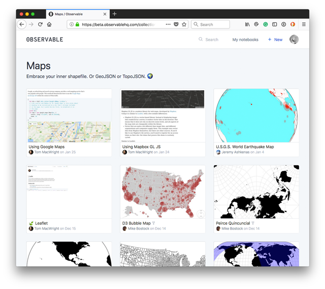  
*Observable interactive notebooks.*

Additionally, there are [Stack Overflow](https://stackoverflow.com/tags/d3.js/) tags for D3 as well as a [Google forum](https://groups.google.com/forum/#!forum/d3-js).

### Transitioning to ES6

You may notice that many examples within Observable are now written in ES6. For instance, we may see the familiar Leaflet map created using a `const` keyword to declare the variable and not our typical `var`.

```javascript
const map = L.map('map').setView([50, 15], 4);
```

What's this all about? The `const` keyword is written in a newer version of JavaScript, known as ES6.

ECMAScript 6 (ES6), also referred to as "ES2015," was released in June of 2015. This new version of JavaScript is a significant improvement over the previous one (ES5). It took some time for all the major browsers to support ES6, and to use it before recently, you needed to "transpile" your ES6 code back into the older ES5 version using a [compiler such as Babel](https://babeljs.io/).

To ensure that ESS6 scripts worked across browsers, you could load the [standalone version of Babel](https://github.com/babel/babel/tree/master/packages/babel-standalone), requesting it within a script tag like this:

```html
<script src="https://unpkg.com/@babel/standalone/babel.min.js"></script>
<script type="text/babel">
  <!-- Your custom ES6 JS here -->
</script>
```

However, most of the ES6 functionality is currently [supported by all client browsers](https://kangax.github.io/compat-table/es6/), so you should feel confident transitioning your JavaScript learning toward ES6 and deploying it within your production code.

You don't need to entirely worry about mastering ES6 overnight, as it's still fine to write ES5 code and even mix with ES6. But it's good to be aware that an increasing number of examples you find on the web will use ES6.

We've shown and used ES6 code in this course and MAP 672. The key things to note are:

* ES6 uses `let` and `const` in place of the `var` keyword for creating variables. There is some more nuanced difference, but basically the `let` keyword is used for variables whose values may change, while `const` is used for values that won't change. Variables declared with `let` or `const` are scoped to the block `{ }` in which they are declared.
* The syntax for writing anonymous function callbacks has been simplified in ES6. Rather than having to write the `function` keyword you can use what's known as an "arrow function" in ES6. For instance we could write some code like this to loop through an array and log the values to console:

```javascript
var numbers = [1,2,3,4,5];
numbers.forEach(function(number) {
  console.log(number);
});
```

Using ES6 we can use the `const` keyword and an arrow function:

```javascript
const numbers = [1,2,3,4,5];
numbers.forEach(number => {
  console.log(number);
});
```

To study more ES6 on your own (perhaps after 673), consider one of [the Best Tutorials To Learn ECMAScript (ES6) For Beginners](https://medium.com/quick-code/the-best-tutorials-to-learn-ecmascript-es6-for-beginners-55fe602382cd). Minimally, be aware of `let`, `const`, and arrow functions reviewed in the [Addendum](#addendum-review-es6-features-needed-for-d3js). We also recommend the [Airbnb JavaScript Style Guide](https://github.com/airbnb/javascript).

Let's get started with a basic HTML template for the lesson. Commit changes as you work and push to the remote repository for backups, help, and the final submission.

## A web map template with Bootstrap

We've provided a starter template to begin web mapping with D3. Begin by opening the HTML [lesson/index.html](lesson/index.html) file within your code editor and live-preview it in your web browser. 

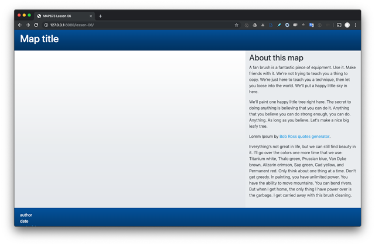  
*Starter page for Lesson 06.*

This template layout was built using Bootstrap and applies a Bootswatch theme called Cerulean from the [Bootstrap CDN](https://www.bootstrapcdn.com/bootswatch/).

Examine the HTML and CSS within this file and launch it in your browser using a local webserver.

```html
<!doctype html>
<html lang="en">

<head>
  <meta charset="utf-8">
  <meta name="viewport" content="width=device-width, initial-scale=1, shrink-to-fit=no">
  
  <title>MAP673 Lesson 06</title>
  
  <link href="https://stackpath.bootstrapcdn.com/bootswatch/4.3.1/cerulean/bootstrap.min.css" rel="stylesheet"
    integrity="sha384-C++cugH8+Uf86JbNOnQoBweHHAe/wVKN/mb0lTybu/NZ9sEYbd+BbbYtNpWYAsNP" crossorigin="anonymous">
  <style>
    #map {
      width: 100%;
      height: calc(40vh);
    }

    #about {
      max-height: calc(80vh);
      overflow-y: scroll;
    }

    /* Small devices (landscape phones, 576px and up) */
    @media (min-width: 576px) {}

    /* Medium devices (tablets, 768px and up) */
    @media (min-width: 768px) {
      #map {
        height: calc(60vh);
      }
    }

    /* Large devices (desktops, 992px and up) */
    @media (min-width: 992px) {

      #map {
        height: calc(80vh);
      }
    }

    /* Extra large devices (large desktops, 1200px and up) */
    @media (min-width: 1200px) {}
  </style>

</head>

<body>

  <div class="container-fluid">
    <header class="row py-3 bg-dark text-white">
      <div class="col mx-2">
        <h1 class="h1">Map title</h1>
      </div>
    </header>

    <section class="row bg-secondary ">
      <div class="col-12 col-md-7 col-lg-8 px-0">
        <div id="map" class="bg-light position-relative"></div>
      </div>
      <aside id="about" class="col-12 col-md-5 col-lg-4 text-dark py-2">
        <section>
          <h2 class="h2 text-dark">About this map</h2>
          <p>A fan brush is a fantastic piece of equipment. Use it. Make friends with it. We're not trying to teach you
            a thing to copy. We're just here to teach you a technique, then let you loose into the world. We'll put a
            happy little sky in here.</p>
          <p>We'll paint one happy little tree right here. The secret to doing anything is believing that you can do it.
            Anything that you believe you can do strong enough, you can do. Anything. As long as you believe. Let's make
            a nice big leafy tree.</p>
          <p>Lorem Ipsum by <a href="https://www.bobrosslipsum.com/index.html">Bob Ross quotes generator</a>.</p>
          <p>Everything's not great in life, but we can still find beauty in it. I'll go over the colors one more time that we use: Titanium white, Thalo green, Prussian blue, Van Dyke brown, Alizarin crimson, Sap green, Cad yellow, and Permanent red. Only think about one thing at a time. Don't get greedy. In painting, you have unlimited power. You have the ability to move mountains. You can bend rivers. But when I get home, the only thing I have power over is the garbage. I get carried away with this brush cleaning.</p>
        </section>
      </aside>
    </section>
    <footer class="row bg-dark text-white py-3">
      <div class="col mx-2">
        <ul class="list-unstyled">
          <li>author</li>
          <li>date</li>
          <li><a href="#">meta data</a></li>
        </ul>
      </div>
    </footer>
  </div> <!-- end .container-fluid -->


  <script src="https://code.jquery.com/jquery-3.3.1.slim.min.js"
    integrity="sha384-q8i/X+965DzO0rT7abK41JStQIAqVgRVzpbzo5smXKp4YfRvH+8abtTE1Pi6jizo" crossorigin="anonymous">
  </script>
  <script src="https://cdnjs.cloudflare.com/ajax/libs/popper.js/1.14.7/umd/popper.min.js"
    integrity="sha384-UO2eT0CpHqdSJQ6hJty5KVphtPhzWj9WO1clHTMGa3JDZwrnQq4sF86dIHNDz0W1" crossorigin="anonymous">
  </script>
  <script src="https://stackpath.bootstrapcdn.com/bootstrap/4.3.1/js/bootstrap.min.js"
    integrity="sha384-JjSmVgyd0p3pXB1rRibZUAYoIIy6OrQ6VrjIEaFf/nJGzIxFDsf4x0xIM+B07jRM" crossorigin="anonymous">
  </script>

  <script src="https://d3js.org/d3.v5.js"></script>
  <script src="https://unpkg.com/topojson@3"></script>

  <script>
    // custom JS goes here
  </script>
</body>

</html>

```

***Code Bank 01.** Starter template Lesson 06.*

You'll see that the template provides a basic webpage with a header, footer, a sidebar, and an empty division element for our map. The design offers a relatively flexible layout, and with the help of Bootstrap's CSS is prepared to modify the layout responsively using media queries.

For instance, if you use the responsive mode of your web developer toolbar, you can see how at a specific breakpoint, the aside sidebar flips to be underneath the space for the map, and the space for the map is now 100% of the screen width.

  
*Responsive layout*

You'll notice the template only provides a couple of custom CSS rules. These rules help establish the height and width of the elements with id attributes of `map` and `about`.

```css
#map {
  width: 100%;
  height: calc(40vh);
}

#about {
  max-height: calc(80vh);
  overflow-y: scroll;
}
```

The rest of the CSS style rules modifying the elements within the page are applied through the various Bootstrap classes. For instance, on the header element we're providing class names of `row` (applies rules for the layout using flexbox), `py-3` (applies 3em of padding to the top and bottom of the element), `bg-dark` (applies the dark color background from the theme), and `text-white` (applies a rule to make the font color white).

```html
 <header class="row py-3 bg-dark text-white">
```

You can search within [Bootstrap's documentation](https://getbootstrap.com/docs/4.3/getting-started/introduction/) for these class names and variations. You can also learn a lot by examining the DOM within your web developer toolbar and inspecting the styles.

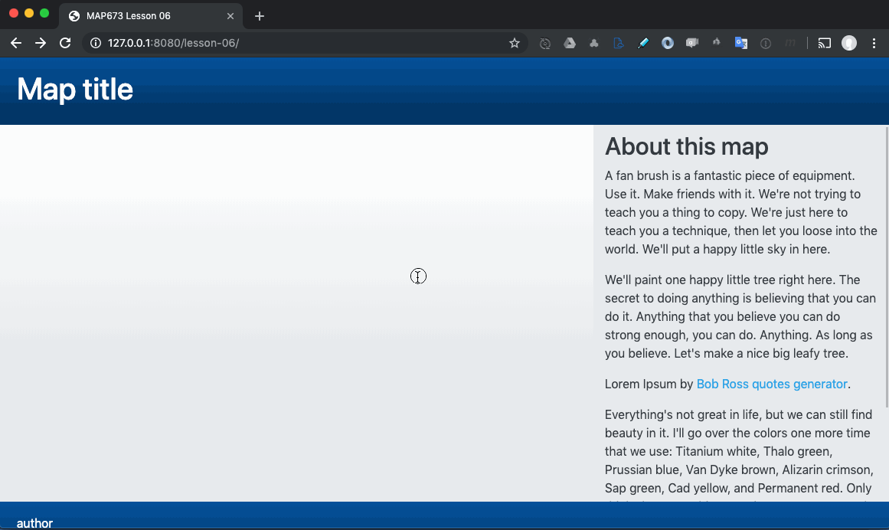  
*Inspecting the styles of the webpage with the web developer toolbar.*

These class names aren't intuitive, and it takes a while reading the docs and looking at other Bootstrap examples to become proficient at designing with a CSS framework like Bootstrap.

## Web mapping with D3

Note that above the currently empty `<script></script>` tags (where we'll write our custom JavaScript), we're loading two additional JS resources from the remote CDN (content delivery network): the D3.js code and another library named TopoJSON (also written by Mike Bostock).

```html
<script src="https://d3js.org/d3.v5.js"></script>
<script src="https://unpkg.com/topojson@3"></script>
```

For this lesson, we're using the latest version of D3, version 5. You can read about the improvements in the [release notes](https://github.com/d3/d3/releases).

If you read the documentation, you'll note that the D3 library is written as a [set of modules](https://github.com/d3) that can either be loaded independently or bundled within a single file (we're doing the latter).

The second script we're loading (`<script src="https://unpkg.com/topojson@3"></script>`) is TopoJSON, another library written by Bostock that extends the GeoJSON format to encode topology (i.e., shared borders). Converting your GeoJSON polygons to TopoJSON before you load the data into a web page is one way to reduce the file size dramatically.

Two web tools for uploading and converting GeoJSON to TopoJSON are [Map Shaper](https://mapshaper.org/) and [geojson.io](http://geojson.io).

### Preparing an SVG element for drawing data with D3

Before we load our data and begin drawing it, we need to create an SVG element within the DOM and give it a height and width. Just like we use jQuery to select DOM elements (e.g., `$('my-div")), we can use D3 as a robust selection tool.

The following JavaScript selects the element `<div id="map"></div>` and assigns a reference to this selection to `mapContainer`. We can then determine the height and width of this element using `.node().offsetWidth` and  `.node().offsetHeight`. We then create and append a new SVG element, using the width and height we derived from the dimensions of the map division element.

```js
// select the HTML element that will hold our map
const mapContainer = d3.select('#map')

// determine width and height of map from container
const width = mapContainer.node().offsetWidth - 60;
const height = mapContainer.node().offsetHeight - 60;

// create and append a new SVG element to the map div
const svg = mapContainer
  .append('svg')
  .attr('width', width) // provide width and height attributes
  .attr('height', height)
```

This is a fancy way of creating the width and height of this SVG. You could provide fixed values, but this approach allows the SVG to be drawn according to the browser/device width.

This code won't change the appearance of our page yet. But we can again use the inspector in the browser tools to confirm and understand how D3 has selected the #map element and appended a new SVG element within it.

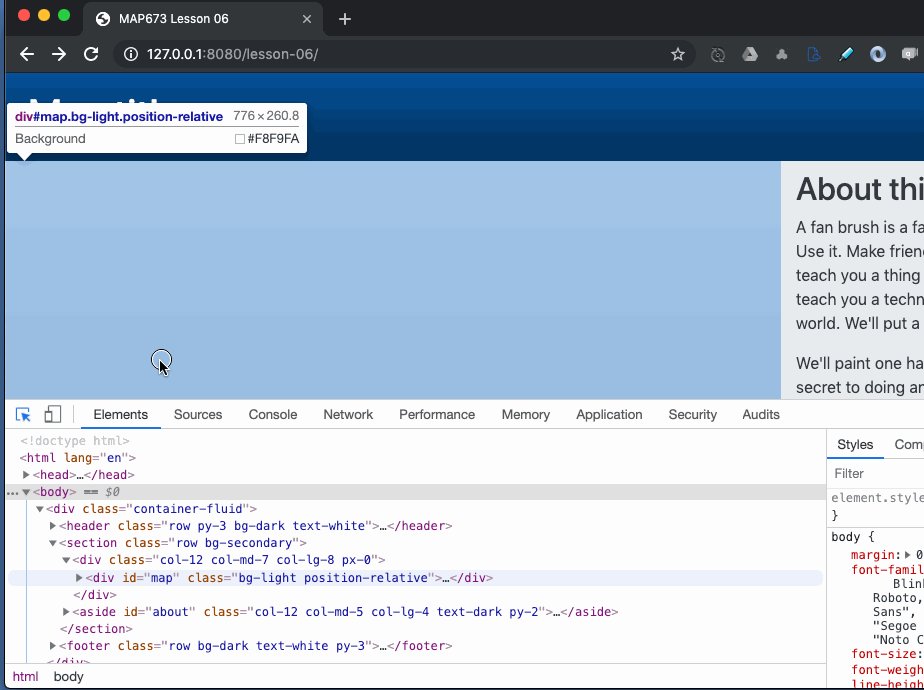  
*Inspecting the new SVG element with the web developer toolbar.*

We now have an SVG element ready to draw our data within. Next, let's load the data.

### Loading data with D3

Throughout New Maps Plus we've explored various means for making AJAX requests to load data using our script:

* jQuery's [.getJSON() method](https://api.jquery.com/jQuery.getJSON/)
* the [Leaflet-Omnivore Plugin](https://github.com/mapbox/leaflet-omnivore) (which converts various formats into a Leaflet L.geoJson object)
* [Papa Parse](https://www.papaparse.com/) (for CSV data)

D3 comes bundled with methods for loading data. These methods are among the best available. In fact, even if you didn't want to use D3 for graphic visualization, you could simply use D3 or the specific [d3-fetch module](https://github.com/d3/d3-fetch/blob/master/README.md#json) to request text files (JSON, CSV, etc.) and load them into your app.

The specific method we'll use for loading GeoJSON and TopoJSON is called [d3.json()](https://github.com/d3/d3-fetch/blob/master/README.md#json).

We're first going to load the [lesson/data/states.geojson](states.geojson) file. These data are US state polygons, drawn from the [US Cartographic Boundary Files](https://www.census.gov/geographies/mapping-files/time-series/geo/carto-boundary-file.html) and converted from the Shapefile format into GeoJSON (see the [data/meta.md](data/meta.md)).

Also, note that we've written the extension `.geojson` here. Typically one would simply use `.json` (D3 will request and parse them both equally). But I'm using `.geojson` here to emphasize a difference in this file from the TopoJSON encoding we'll use below.

Within the `<script></script>` tags, write the following lines of code:

```javascript
// request the JSON text file, then call drawMap function
d3.json("data/states.geojson").then(drawMap);

// accepts the data as a parameter countiesData
function drawMap(data) {
  // log data to console
  console.log(data);
}
```

The first method (`.json()`) is the D3 method we've introduced. The second method, chained to the returned result from the first, is [`.then()`](https://developer.mozilla.org/en-US/docs/Web/JavaScript/Reference/Global_Objects/Promise/then). The `.then()` method is not D3 code, however. It's a native JS method supported by the browser without the help of a library like D3. The method waits for the AJAX request to be complete and then calls a function, passing any data as an implicit argument. In this case, we're calling a function named `drawMap()` and passing the contents of the data file as the argument.

Let me repeat what I just wrote because it's one of the things that makes D3 awesome: we're chaining native JS methods to D3 methods! As we encounter when learning web map development, it's often frustrating knowing which native, jQuery, or Leaflet methods apply to which object. And as we've learned, Leaflet methods below on Leaflet objects, jQuery methods to JQuery methods.

When in the quotation above, Bostock writes "D3's emphasis on web standards gives you the full capabilities of modern browsers without tying yourself to a proprietary framework," this is precisely what he means. The beauty of D3 is it's closeness to web standards, using minimal abstraction.

Examine the output in your browser's Console:

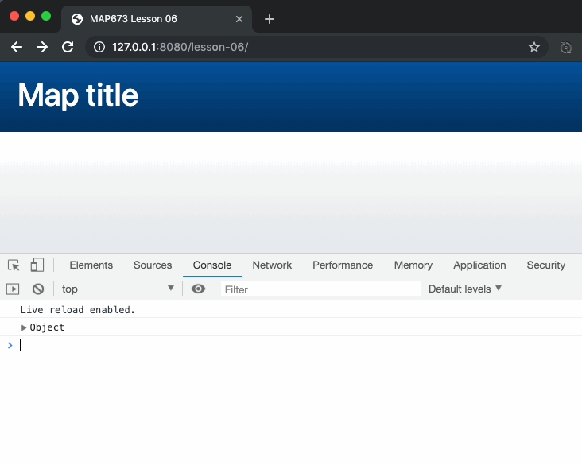  
*States GeoJSON logged to the Console.*

You should be able to recognize the now familiar GeoJSON structure encoded as a JSON object. Now that we have our data loaded into the script, let's create a map.

## Drawing a map with D3

We'll now create a basic basemap consisting of US states polygons. We're also going to project this map using a special variant of the [Conic Equal Area projection](https://github.com/d3/d3-geo/blob/master/README.md#geoAlbersUsa) that moves and resizes Alaska and Hawaii to fit within the landscape orientation of the map.

Our `drawMap(data)` function is written with one parameter, which we've named `data`. This parameter references our GeoJSON data. Write the following code within the `drawMap()` function. The comments help explain what the code is doing (though it will likely still be fairly confusing, which is okay):

```js
function drawMap(data) {

  // declare a geographic path generator
  // fit the extent to the width and height using the geojson
  const projection = d3.geoAlbersUsa()
    .fitSize([width, height], data);

  // declare a path generator using the projection
  const path = d3.geoPath()
    .projection(projection);

  // append states to the SVG
  svg.append('g') // append a group element to the svg
    .selectAll('path') // select multiple paths (that don't exist yet)
    .data(data.features) // use the feature data from the geojson
    .join('path') // join the data to the now created path elements
    .attr('d', path) // provide the d attribute for the SVG paths
    .classed('state', true) // give each path element a class name of state

} // end of drawMap function
```

Note that the variable `svg` we declared above now references the SVG selection in the DOM, so we can use D3 to begin creating and appending new elements within it. Saving those changes and testing in the browser should reveal a familiar map.

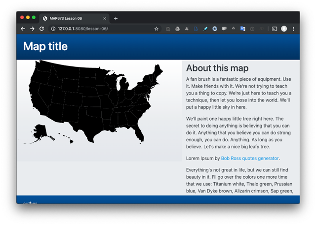  
*States GeoJSON drawn within the DOM as path elements.*

A lot is happening in these few lines of "simple" code, which is why D3 is both popular and terrifying. It is helpful to read the API documentation carefully to better understand how it all works (hint: try searching for the method names).

Again, use the inspector to understand better (and verify) how D3 appended the SVG elements we're using to represent our geometries.

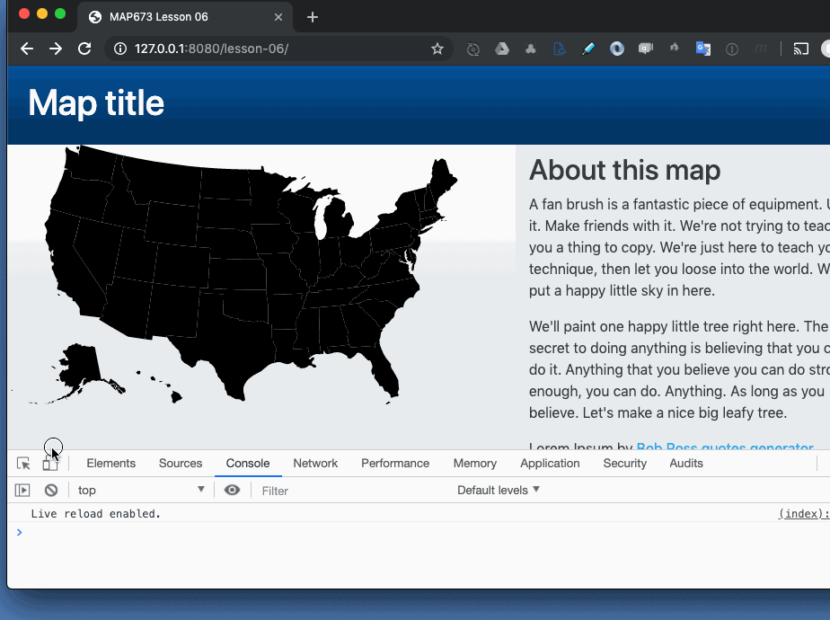  
*Inspecting the SVG path elements drawn from the GeoJSON data.*

We can see that the D3 methods have:

* created a new `g` element (a native SVG element), and
* inserted many paths (symbolizing our counties) within the `g` element

We can see the value of the `d` attribute (which defines the screen coordinates of path of the `path` element, translated from lat/lon values with the projection generator). Also, our class of `state` has been added to each path element.

### Styling SVG with CSS

Because all our county path elements have a class name on them, we can select them all with either JavaScript or CSS. Within the `<style></style>` tags in the head of the document, add a CSS style rule that selects the states, provides a stroke color and width, and removes a fill color:

```css
.state {
  fill: none;
  stroke: #eb7f86;
  stroke-width: 2;
}
```

The style rule uses SVG properties. These are not necessarily the same as those targeting HTML elements that you would write in CSS. Read more about [using CSS with SVG](https://developer.mozilla.org/en-US/docs/Web/SVG/Tutorial/SVG_and_CSS) (seriously!).

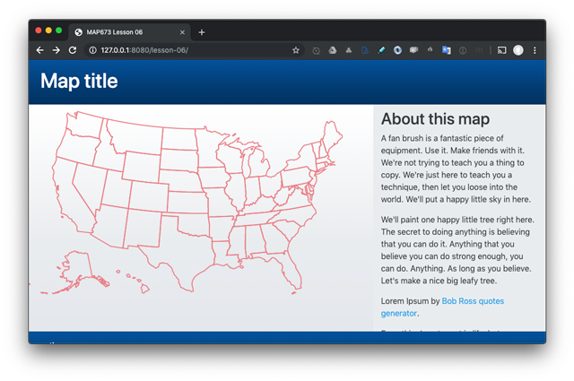  
* SVG pathes styled with CSS.*

Great success! Is this your first map with D3? Let's bring in another data file, US counties.

### Loading multiple files with D3

We're going to modify the code slightly we've written so far to include a request for a second file, [_counties.topojson_](lesson/data/counties.topojson).

Replace the statement that requests the _states.geojson_ file with the following code:

```js
// request our data files and reference with variables
const stateGeoJson = d3.json('data/states.geojson')
const countyTopoJson = d3.json('data/counties.topojson')

// wait until data is loaded then send to draw map function
Promise.all([stateGeoJson, countyTopoJson]).then(drawMap);
```

Saving and testing this code should break your script. What is being passed to the `drawMap()` now? Within the function, we can log the parameter to console to find out.

```js
function drawMap(data) {

  console.log(data)
```

We can see that the `data` parameter references our two data, stored within an array in the order in which we passed them within the `all()` method.

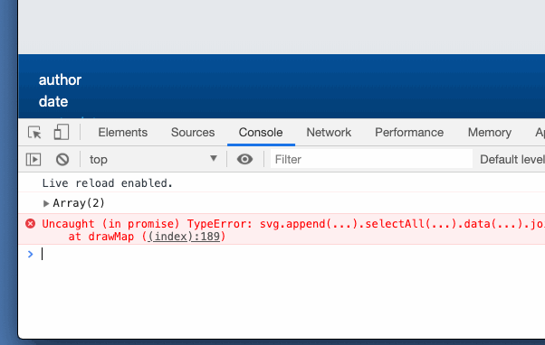  
*Logging the parameter from the Promise method.*

Assign a reference to the two data sets to variables for ease of use within the script that follows.

```js
function drawMap(data) {
  
  // refer to different datasets
  const stateData = data[0];
  const countiesData = data[1];
```

We're likely generating an error and need to update the code, replacing `data` with `stateData`.

```js
  // fit the extent to the width and height using the geojson
  const projection = d3.geoAlbersUsa()
    .fitSize([width, height], stateData); // update here

  // append states
  svg.append('g')
    .selectAll('path')
    .data(stateData.features) // update here
    .join('path')
    .attr('d', path)
    .attr('class', 'state')
```

At this point, if there are no errors, our page should be working again displaying the red/orange state borders.

  
*SVG pathes styled with CSS.*

Now that we have the TopoJSON file loaded into the script, we should pause to consider what this is and means.

### Using TopoJSON with D3

Above, we logged to console our counties dataset encoded within the TopoJSON format (you can also open the **data/counties.topojson** data file in your text editor). It looks like GeoJSON and has similar properties (e.g., ```properties"`).

But as you can see, it doesn't contain all the latitude and longitude values for the polygon features. Instead, these coordinates have been converted to screen coordinates and share common borders. This conversion drastically reduces the size of the data files.

However, to join the data to path elements as we did above, we first convert the TopoJSON back into GeoJSON using the TopoJSON method `.feature()`.

```js
// convert the TopoJSON into GeoJSON
const countiesGeoJson = topojson.feature(countiesData, {
  type: 'GeometryCollection',
  geometries: countiesData.objects.counties.geometries
});
```

After we convert the TopoJSON to a Geo

Now we want to draw the county geometries underneath the state borders. To do so, write the following code **above the code that creates the states** (so it will be appended to the svg and rendered below the states with the hollow fill):

```js
// append a new g element
const counties = svg.append('g')
  .selectAll('path')
  .data(countiesGeoJson.features) // use the GeoJSON features
  .join('path')  // join them to path elements
  .attr('d', path)  // use our path generator to project them on the screen
  .attr('class', 'county') // give each path element a class name of county
```

Saving these changes should display the counties' geometries beneath the state borders.

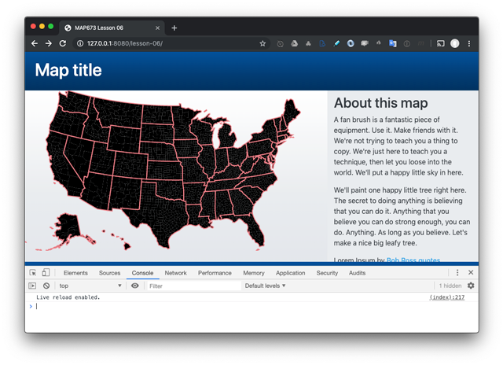  
*County SVG pathes.*

And, just like the states, we can select them with CSS and provide style properties. We can also make use of the CSS `:hover` pseudo-class to provide a visual affordance when mousing over the counties.

```css
.county {
  fill: #fac484;
  stroke: #f8a07e;
}

.county:hover {
  fill: #f3e79b;
  stroke: #eb7f86;
  stroke-width: 2;
}
```

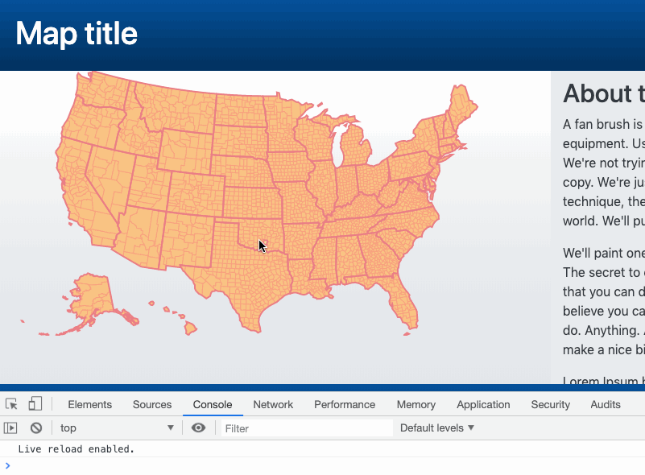  
*County SVG pathes with style rules.*

By default, SVG is anchored to the top left corner of container elements; hence our map may be positioned closer to the top left than we'd like. One solution is to give the SVG element absolute positioning (within the `<div #map></div>` which has relative positioning) and provide a couple other style rules using D3 methods `.classed()` (which adds or removes class names from elements) and `.style()` (which applies CSS style rules). 

Update your existing JS with these additions:

```js
const svg = mapContainer
  .append('svg')
  .attr('width', width)
  .attr('height', height)
  .classed('position-absolute', true) // add bootstrap class
  .style('top', 40) // 40 pixels from the top
  .style('left', 30); // 40 pixels from the left
```

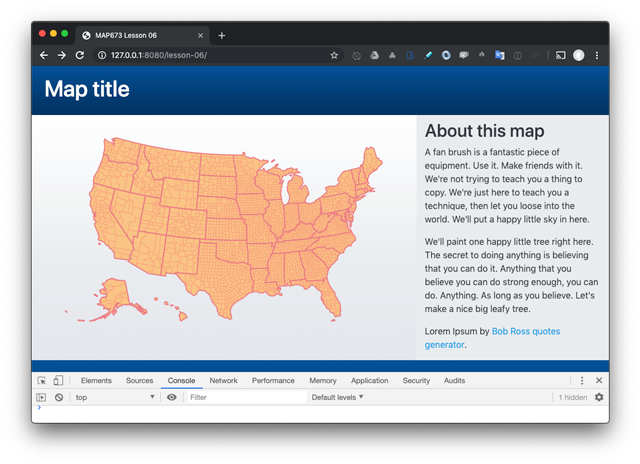  
*Map styled.*

Before we move on, let's play with some projections to understand better how to customize a map of a specific area or for specific purposes (i.e., greater accuracy for area, distance, etc.).

## Using projections in D3

The preceding code and process made producing this map with D3 very easy. The d3.geoAlbersUsa() method is convenient for this dataset. However, achieving a desirable result with various geographies and scales requires [a bit more work](https://bl.ocks.org/mbostock/4282586).

Let's use a different D3 projection method, one for an equidistant projection. Try changing your projection method:

```javascript
const projection = d3.geoConicEquidistant()
  .fitSize([width, height], countiesGeoJson)
```

The result isn't exactly what we're looking for:

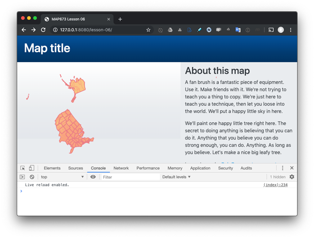  
*Map using an Albers equidistant projection.*

To understand how to fix the issue it's best to dig into the API documentation for the [d3.geoConicEquidistant() projection](https://github.com/d3/d3-geo/blob/master/README.md#geoConicEquidistant). We can't stress enough how important this is if you want to become a D3 wizard.

To center the contemporaneous United States we can adjust the code as follows (omitting the `.fitSize()` method):

```javascript
      const projection = d3.geoConicEquidistant()
        .center([0, 40])  // center of geography in latitude
        .rotate([97,0])  // rotate the earth negative degrees in longitude
        .scale(600)  // adjust the scale (i.e., "zoom")
        .translate([width/2, height/2]);  // move the project to the center of the SVG
```

This code should result in a reasonably placed map, though the value of the scale. 

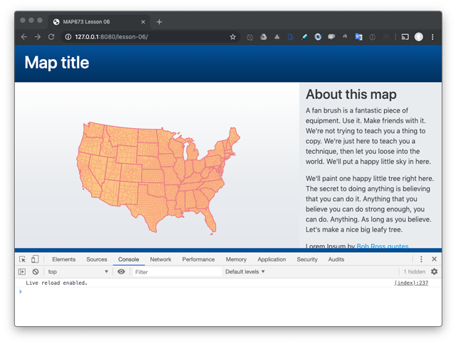  
*Map using an Albers equidistant projection, adjusted.*

We won't go into more detail about projections now. The best way forward is to experiment with new geometries, read the API, and [look at examples](https://observablehq.com/collection/@d3/d3-geo).

Feel free return your projection to the original before proceeding (it's nice to have Alaska and Hawaii in there):

```javascript
var projection = d3.geoAlbersUsa()
  .fitSize([width, height], geojson)
```

## Adding interaction to elements with D3

We have a basic working map. Let's explore a couple more D3 methods and add some user interaction: an affordance and a tooltip.

### Adding a visual affordance to the map

Next we'll build a customized tooltip to retrieve specific information about our county features (in this case simply the name as an example). First Use D3 to create a new HTML division element (yes D3 can select, create, or destroy both HTML and SVG elements). Write this code above where you create the counties in your script:

```js
// Create  div for the tooltip and hide with opacity
const tooltip = d3.select('.container-fluid').append('div')
  .attr('class', 'my-tooltip bg-warning text-white py-1 px-2 rounded position-absolute invisible');

// when mouse moves over the mapContainer
mapContainer
  .on('mousemove', event => {
    // update the position of the tooltip
    console.log(event)
    tooltip.style('left', (event.pageX + 10) + 'px')
      .style('top', (event.pageY - 30) + 'px');
  });
```

Note that we also placed an event handler on the map itself to update the position of the tooltip within the page. We currently can't see the tooltip because we included the Bootstrap class `invisible`.

We'll now attach two event handlers to our counties, one for mousing over the path elements we've created, and one for mousing out or off the elements. We'll do so by adding a couple event handlers to our counties selection. Write this code below where you created the counties in your script. Also note here we're using the arrow functions:

```javascript
// applies event listeners to our polygons for user interaction
counties.on('mouseover', (event, d) => { // when mousing over an element
  d3.select(event.currentTarget).classed('hover', true).raise(); // select it, add a class name, and bring to front
  tooltip.classed('invisible', false).html(`${d.properties.NAME} County`) // make tooltip visible and update info 
})
.on('mouseout', (event, d) => { // when mousing out of an element
  d3.select(event.currentTarget).classed('hover', false) // remove the class from the polygon
  tooltip.classed('invisible', true) // hide the element 
});
```

We can now see the tooltip when mousing over the county polygons.

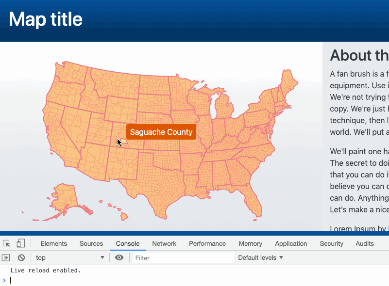  
*Applying CSS rules to SVG paths when mousing over.*

It's important to note here how we access the information about the target county. Within the callback function we pass a few arguments. The `event` argument allows us to access the properties of the event and placed SVG. The `d` argument references our GeoJSON data for that feature.

Try logging the value of `d` to Console within the callback function:

```javascript
counties.on('mouseover', (event, d) => { // when mousing over an element
    console.log(d);
    d3.select(event.currentTarget).classed('hover', true).raise(); // select it, add a class name, and bring to front
    tooltip.classed('invisible', false).html(d.properties.NAME +
      ' County') // make tooltip visible and update info 
  })
```

Just like in Leaflet when we access layer properties with `layer.feature.properties`, we see how in D3 the value of the callback parameter is the feature itself.

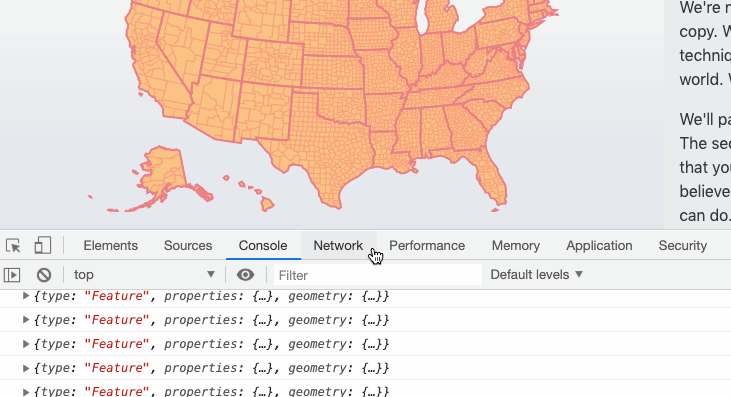
*Logging the value of d to console*

Finally, update the title of the map, the information in the footer, and replace the fun Lorem Ipsum text in the aside.

This completes the lesson part of Module 06. Please save your work within the **lesson/** directory. Commit your work to Git along the way and push to the remote for a backup, help, and the final submission (**4 pts**).

Take a break, and then move on to Module 06 [Assignment](assignment/).

## Resources

[D3 in Depth](https://www.d3indepth.com/)

## Addendum: Review ES6 features needed for D3.js

To best understand many D3.js examples in its documentation, let's review the two important updates to the JavaScript standard.

### `const` and `let` variables

We have extensively used the `var` keyword to declare and assign variables. These variables are globally accessible in the way that we've used them. This can prove tricky in larger applications or with temporary variables. Consider the bit of code we've been using to iterate through our city arrays. The `i` and `nameAndPop` variables are temporary, i.e., they are only used in the `for` loop. But, after our loop runs, they are still defined. Ideally, we would dispose of these variables after they are used. (Also note how the `nameAndPop` variable is built.)

```javascript
var cities = ["Lexington", "Louisville", "Frankfort"];
var cityPops = [308428, 756832, 25527];

for (var i = 0; i < cities.length; i++) {
    var nameAndPop = `${cities[i]} population: ${cityPops[i]}`;
    console.log(nameAndPop);
}

console.log(i, nameAndPop); 
// returns the last iteration and is available everywhere
```

The `let` and `const` [variables](https://wesbos.com/let-vs-const/) remove this potentially confusing situation. The `const` variable is short for *constant* variable. Once a `const` variable is made, it can not be re-declared or have its existing value changed. Though, its properties can change, such as an array with new values added. Let's consider some examples.

```javascript
const cityPops = [308428, 756832, 25527];

// Re-declaring this variable is not permitted
const cityPops = [308428, 756832, 25527, 44524];
// or 
cityPops = [308428, 756832, 25527, 44524];
// both of these will throw an error.

// Adding new values into the array is allowed
cityPops.push(44524);
cityPops[4] = "Adding new values!"
console.log(cityPops)
```

The `const` variable ensures that, once declared, it remains the same data type (string, array, etc.) and only it's properties can change. 

What if you need to have a value change temporarily, like in a `for` loop? We'll use the `let` variable declaration. 

```javascript
const cities = ["Lexington", "Louisville", "Frankfort"];
const cityPops = [308428, 756832, 25527];

for (let i = 0; i < cities.length; i++) {
    let nameAndPop = `${cities[i]} population: ${cityPops[i]}`;
    console.log(nameAndPop);
}
console.log(i, nameAndPop); // Returns an error. This is good!
```

Why would returning an error be good? In our case, we have *let* the variables `i` and `nameAndPop` be used within our loop, but not outside of it. We can reuse those variable names again without error or conflict with other variables. This property shows another dimension of how these new variables work.

When used inside curly brackets `{}`, a *block* of code, both `let` and `const` variables are limited to that block. We call this *block scope* and helps fence in variables and prevent rewriting variable values. We cannot re-declare `const` and `let` variables in the same scope, which protects variables from unintentional change. (We'll talk more about the scope of variables in the module on functions.) 

Consider the following code where we use existing variables inside a `for` loop block. Because they're used inside the block, they're limited to only that block and prevent overwriting the existing variable values.

```javascript
const cities = ["Lexington", "Louisville", "Frankfort"];
const cityPops = [308428, 756832, 25527];
const i = 23; // my fav number
const name = "Monkey's Eyebrow"; // my fav Ky city name
for (let i = 0; i < cities.length; i++) {
    let name = `${cities[i]} population: ${cityPops[i]}`;
    console.log(name);
}
console.log(i, name); // preserves the const variable values
```

If we used the `var` declaration, then the original variable values are lost. Not good! Of course, if you are observant about using unique variable names, you should be okay. The problem is more likely to arise in more complex codebases with multiple contributors. It takes only one variable reassignment to wreak havoc.

```javascript
const cities = ["Lexington", "Louisville", "Frankfort"];
const cityPops = [308428, 756832, 25527];
var i = 23; // my fav number
var name = "Monkey's Eyebrow"; // my fav Ky city name
for (i = 0; i < cities.length; i++) {
    name = `${cities[i]} population: ${cityPops[i]}`;
    console.log(name);
}
console.log(i, name); // 😒
```

### arrow functions

The JavaScript ES6 specification gave us `let` and `const` that we introduced in a previous module. Another feature introduced in ES6 is the [*Arrow Function*](https://www.w3schools.com/js/js_arrow_function.asp), also known as fat arrow functions, and has quickly become a popular way to write concise functions. For example, one parameter, single statement arrow functions do need the `return` or `function` keywords, curly brackets, nor parentheses. Let's consider the classic first function that prints, "Geography Y'all!" to the Console.

```js
// As a function declaration
// These functions are loaded before all other code.
// They are hoisted.
function hello() {
  return "Geography Y'all!";
}

// As a function expression
// Runs when program reaches this line of code.
// Not hoisted

const hi = function() {
  return "Geography Y'all! (A second time!) ";
}

console.log(hello(), hi())
```

We use the `const` variable because a function expression is always a constant value. Let's use the arrow function to create the same behavior. First, all arrow functions are limited function expressions and need to defined before they are called. We can remove the keyword `function` and add `=>` after the parentheses.

```js
const hiArrow = () => {
  return "Geography Y'all! (A second time!)";
}
console.log(hiArrow())
```

Because we have one statement in the function body, we can remove the keyword `return` and also remove the curly brackets `{}`.

```js
const hiArrow = () => "Geography Y'all! (A second time!)";

console.log(hiArrow())
```

If we wanted to add a parameter to this function, we can put it in the parentheses as normal. But, if we have only one parameter, we can omit the parentheses, too. This is "syntactic sugar!"

```js
const hiArrow = welcome => `${welcome}, Geography Y'all!`;

console.log(hiArrow("Stuck in Space"))
// output: Stuck in Space, Geography Y'all!
```

Arrow functions are best used for writing small, concise, and easily readable callback functions. Let's look at an example using the `.map()` [function](https://developer.mozilla.org/en-US/docs/Web/JavaScript/Reference/Global_Objects/Array/map) (more correctly it's called an array "method" and we'll address `methods` in a subsequent lesson). This `.map()` method will create a new array by calling a function on every element, in order, of an existing array. Let's take a look at a practical example.

```js
// define some measurements
const myMeasures = [45, 23, 9, 543, 7, 54, 23, 4]

// create a new array by iterating over each element and executing a function
const myValues = myMeasures.map(measures => {
  if (measures > 40) {
    return true
  } else {
    return false
  }
});

console.log(myValues)
// output: (8) [true, false, false, true, false, true, false, false]
```

The use of the arrow function in the `.map()` callback function makes it easier to read. The arrow function is anonymous, i.e., doesn't have a name, doesn't use the `function` keyword, and passes an argument called `measures` to access each element in the array. The argument name is arbitrary and only needs to conform to proper variable names. The function block uses `if/else` statement to create values in an array called, `myValues`. While the arrow function makes writing code like this less verbose, it is not a suitable replacement for all functions. Notably, the keyword `this` does not behave like in standard functions.